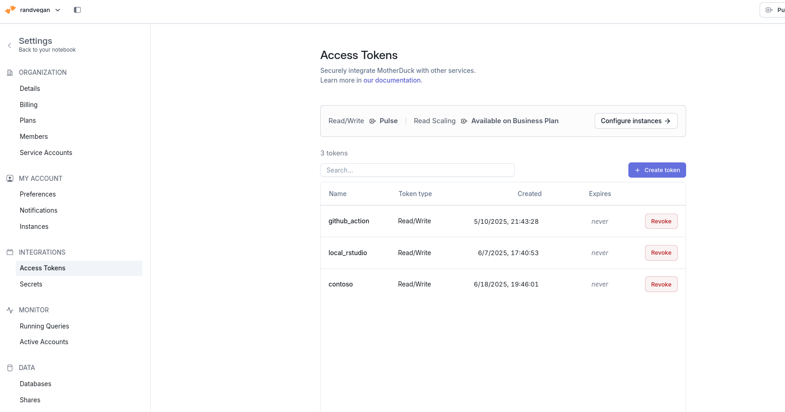

# My Project


# Developer notes

- finish apis
- create the new create\_\* family of functions
- create tests with describes
- update documentation with more examples

# My Project

This is WIP collection of utilities to help with the management,
administration and navigation of [duckdb](https://duckdb.org/) database
either locally on your computer or in the cloud via
[motherduck](https://motherduck.com/)

Database management is incredibly easy in R with fantastic packages such
as [DBI](https://dbplyr.tidyverse.org/) and
[dbplyr](https://dbplyr.tidyverse.org/), however some databases have
specific extensions or utilities that are only aren’t readily accessible
via this packages

MD simplifies these utilities and common database administration task
with easy to understand syntax. MD is built upon
[DBI](https://dbplyr.tidyverse.org/) and returns a lazy DBI object so
that you can further fully integrate your data with
[dbplyr](https://dbplyr.tidyverse.org/)

Eventually, I’ll use the learnings from this package to create a meta DB
utilities package so that regardless if you’re in snowflake, DuckDB,
redshift, etc you will have generalized functions that work across your
database types

This is very much work in progress – I’ll eventually transition to the
[R7](https://rconsortium.github.io/S7/articles/S7.html) object system
but just want to get some usage first before deciding on the
architecture and structure.

Please create an issue if you have any comments or requests or reach out
if you have any feedback.

# Overview of functions

## functions that help you manage your connection and database metadata

- `connect_to_motherduck()` will leverage your motherduck token to
  connect you to your motherduck instance (it will install motherduck
  extension if not created)
- `load_extensions()` will load a duckdb extensions either from an
  official repository or if you set the flag, a community repository
- `install_extensions()` will install various duckdb extensions from the
  official repository
- `validate_*()` collection of functions will just validate your
  connection and extension status

## functions that help you see what is in your databases

- `pwd()` prints the current database that you are “in”
- `cd()` will change your “root” database so that the list\_\* familiy
  of functions are relative to that root
- `list_database()` list the databases and their metadata
- `list_schema()`list the schemas and their metadata
- `list_table()`list the tables and their metadata
- `list_view()`list the views and their metadata

## functions that will help you read data into duckdb or motherduck

- `read_httpfs()` will read httpfs file formats directly into duckdb
- `read_parquet()` will read parquet file formats directly into duckdb
- `read_excel()` will read excel files directly to your database

## functions that will help you create or replace databases, scehems, tables or views

- `create_or_replace_database()` will take R data and create a database
  with your data

- `create_or_replace_schemas()` will take R data and create a schema
  with your data

- `create_or_replace_view()` will take R data and create a views with
  your data

- `create_or_replace_table()` will take R data and create a tables with
  your data

- `drop_table()` will delete a table from your databases

- ## functions to help you understand your data

- `summary()` will summarize your table or view’s data

## What do I need to use this?

- [duckdb](https://duckdb.org/) package installed on your computer
- Optional: If you want to store your data in
  [motherduck](https://motherduck.com/), then you need your own
  motherduck account and an access token which can be saved to your R
  environment file with `usethis::edit_r_environ()`
- data that you want to upload to

> [!NOTE]
>
> ### Whats the difference between Motherduck and Duckdb?
>
> - Duckdb is a database that you can deploy and run either temporary or
>   permanently in your computer. If you run it via your local computer,
>   it is only available on your computer
>
> - Motherduck is a cloud based deployment of duckdb which means you can
>   save your data in the cloud and then access it locally via your
>   database
>
> - Most core functions in this package work for both
>
> - It is just a question if you want you data to be access only locally
>   on your computer or if you want to be able to access it remotely via
>   the cloud

# Lets see the package in action

## Create a duckdb instance and Connect to your motherduck account

When creating a duckdb database, you have three options

1.  A temporary instance that exists in your local computer
2.  A permenant instance that exists in your local computer
3.  A cloud-based instance through [motherduck](https://motherduck.com/)

If you want to set up a local instance you can easily do that with the
md package or you can you just DBI and duckdb package as well, there’s
no real advantage to the md package

Simply clarify the type argument: - `temp` for a temporary file - `file`
location to a new or existing database file - `md` for your motherduck
account

``` r
library(epoxy)
```

It cost \$123,456.

If you select then you need to either manually pass along your
motherduck token or if saved in your environment file pass the
environment variable

``` r
con <- connect_to_motherduck("MOTHERDUCK_TOKEN")
```

You can validate if you are connected to motherduck vs. creating a local
duckdb instance through the validate_md_connection_status

``` r
validate_md_connection_status(.con)
```

When connecting to motherduck there are a number of configuration
options available, you can reference them via the md::config which will
pull a list of the default values

To change these, simply edit the configuration options you want and then
pass this as an argument

``` r
config <- md_config

config$allow_community_extensions <- "true"

con <- connect_to_motherduck("MOTHERDUCK_TOKEN")
```

Congratulations, you’ve set up your duckdb database!

Now let’s learn some duckdb specific adminstration functions

# Database adminstrative functions

- list_extensions()

- install_extensions()

- load_extensions

- validate_install_status

- validate_load_status

- show_duckdb_settings()

- These are a collection of motherduck specific database utilities to
  help you list, install and load duckdb extensions

- the full list of extensions is available via duckdb community store
  are listed
  [here](https://duckdb.org/docs/stable/core_extensions/overview.html)

- the `list_extensions()` will list duckdb extension from the community
  store and list their status, install or loaded

- you can use `install_extensions()` to install a new exnsion – this
  will also automatically load the extension

- If the extension is already install you can use xx

``` r
list_extensions(con)
```

``` r
# md::install_extensions(con,"fts")
# validate_extension_load_status(con,extension_names = "motherduck")
# validate_extension_install_status(con,c("excel","arrow"),return_type = "msg")
```

> [!NOTE]
>
> ### how to create a motherduck account and access token?
>
> 1.  go to [motherduck](https://motherduck.com/) and create an account,
>     free options are available
> 2.  Go to your user name in the top right, click settings then click
>     access tokens
> 3.  Click create token and then name your token and copy the token
>     code
> 4.  You will need this token to access your account
> 5.  If you want to access it via R then simplest way is to save your
>     access code as a variable in your r environment
> 6.  Simply leverage the {usethis} function `edit_r_environ()` to set
>     your access code to a variable and save it – this is one time
>     activity
> 7.  To check if your correctly saved your variable then you can use
>     the Sys.getenv(“var_name”) with “var_name” the named you assigned
>     your access token to
> 8.  Going forward, if you want to access your token you don’t need to
>     re-type the access token, simply remember your variable name
>
> - First you will need a motherduck account, which has both free and
>   paid tiers
>
> - Once you’ve created an account, simply, go to your settings and
>   click ‘Access Tokens’ under your ‘Integrations’
>
> - Keep this secure and safe as this lets you connect to your online
>   database to read or write data
>
> - Open R and use the `usethis::edit_r_environ()` function to put your
>   motherduck token as a variable in your enviornment profile
>
>   - MOTHERDUCK_TOKEN=‘tokenID’
>
> - From there you can use the
>   `connect_to_motherduck("MOTHERDUCK_TOKEN")`
>
> - This will use the
>   [pool](https://solutions.posit.co/connections/db/r-packages/pool/)
>   library to create a connection to your mother duck instance
>
> 
